```{r setup, include=FALSE, warning=FALSE, message=FALSE}
library(knitr)
library(rmdformats)
library(tidyverse)
library(devtools)
# figs folder
if (!file.exists("figs")) {
  dir.create("figs")
}
# data folder
if (!fs::file_exists("data")) {
  fs::dir_create("data")
}
# JSON data
if (!fs::file_exists("docs")) {
  fs::dir_create("docs")
}
# chunk options
knitr::opts_chunk$set(
  echo = TRUE, # show/hide all code
  error = TRUE, # hide results
  tidy = FALSE, # cleaner code printing
  comment = "#> ", # better console printing
  eval = TRUE, # turn this to FALSE stop code chunks from running
  message = TRUE, # show messages
  warning = FALSE, # show warnings
  size = "small", # size of the text
  fig.path = "figs/", # location of files
  fig.height = 5.5, # height of figures
  fig.width = 8 # width of figures
) 
# knit options
knitr::opts_knit$set(
  width = 78,
  progress = FALSE
)
# base options
base::options(
  tibble.print_max = 25,
  tibble.width = 78,
  max.print = "1000",
  scipen = 100000000
)
options(max.print = 999999)
```


## Slide 1: Cleaning data (part 2)

Advanced cleaning with OpenRefine
link for slides: http://bit.ly/bu-cleaning-data-p2 

## Slide 2:  First steps:

```{r openrefine.png, echo=FALSE}
# fs::dir_ls("figs")
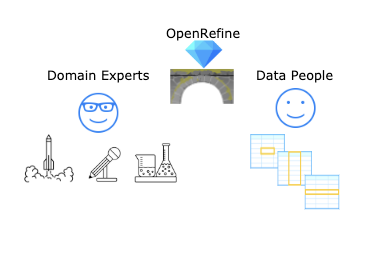
```


Make sure you've downloaded and installed OpenRefine:
http://openrefine.org/download.html

1) Go to the Downloads page
2) Select the appropriate application for your computer

> See more information on downloading the OpenRefine software here: https://github.com/OpenRefine/OpenRefine/wiki/Installation-Instructions 

## Slide 3: What we'll cover

1. First things first (software installation check)

2. Web technologies and non-rectangular data types

3. Wrectangling your data

4. Make it reproducible  

5. Share your work!

> *Many times, the data we encounter on the web (and other places) is in a format we can't directly use, so we need to make some changes to the structure to make it more useful.*
> *The internet is full of all kinds of data types, and we want to be able to access, clean, format, restructure, visualize, and analyze all of it. OpenRefine is a tool that helps us take in a variety of data formats and clean it into something we can use.*

## Slide 4: So much data work to do...

> *Today, we capture and store a massive amount of data electronically. But often, the format and structure for capturing and measuring data are not ideal for creating visualizations or performing analyses. This situation means we need to clean data (prepare them) for analysis.*

## Slide 5: What is/where are data?

```{r 02-data-storage, echo=FALSE}
# fs::dir_ls("figs")
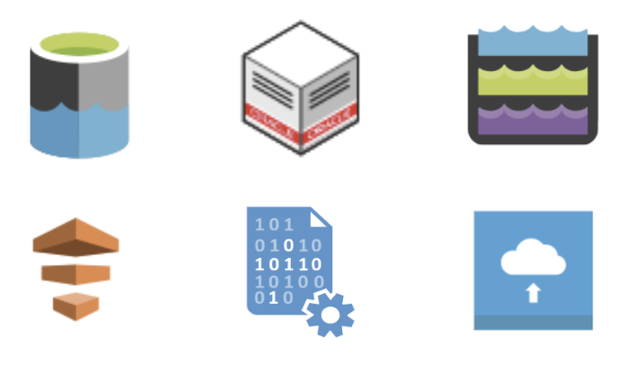
```

Data are everywhere we look, and they're being used to measure nearly anything we can imagine

Numbers, text, pictures, audio, videos--there's no limit to what we can capture. 

> *Data get collected from apps, devices, sensors, scanned documents, the internet, and relational databases. Storage like this usually results in a variety of file formats. Before a software algorithm can go looking for answers, the data must be cleaned up and converted into a unified form that the algorithm can understand.*

## Slide 5: But cleaning data isn't sexy

```{r 03-janitor-work, echo=FALSE}
# fs::dir_ls("figs")
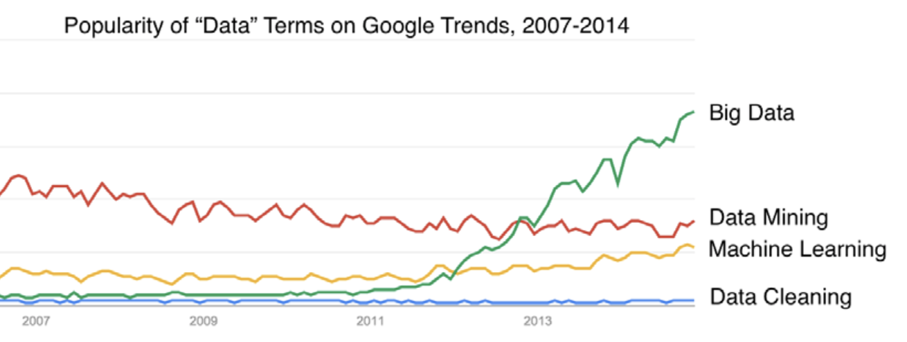
```

https://www.nytimes.com/2014/08/18/technology/for-big-data-scientists-hurdle-to-insights-is-janitor-work.html

## Slide 6: Fundamentals – File Types and Structure

> *As we've noted, the information we find on the web (and other places) is in a format we can't directly use. In the next few slides, we're going to present what these formats are, why people use them, and how we can convert them into something we can analyze.* 

## Slide 8: Data come in a variety of file formats

```{r 8.1-data-types, echo=FALSE}
# fs::dir_ls("figs")
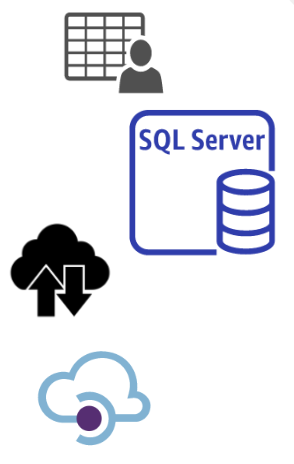
```

Someone sends you data in a downloadable file 

You log into an interactive front-end and retrieve the data from a storage system (i.e., an MS SQL server database system)

The data are available via a continuous stream that's capturing web traffic (i.e., social media)

You access the data through an Application Programming Interface (API)

> *Each of these methods might create a different file type, so it's essential to know the strength and weaknesses of each. A single file that gets emailed to you is handy because you can always return to the original email to retrieve it. However, more extensive data sources require you to interact with them via a virtual machine or desktop (VMware or VirtualBox). Sometimes there is a constant stream of data coming in from users, like on a social media application or online business. Finally, sometimes, companies or organizations have a portal for accessing data called an Application Programming Interface (API).*

## Slide 9: Types of files: text files

```{r 05-plain-text.png, echo=FALSE}
# fs::dir_ls("figs")
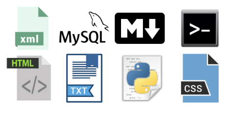
```


Computer files generally belong to two broad groups, commonly called text files and binary files:

Files like web pages, computer source code, and open-source programming languages are all text files

These files can be opened in a text editor (Notepad, Text Edit, etc.) or via the command line

Humans and computers can read these files

> *These files consist of only text characters (UTF-8 and UTF-16)*

> *Editing them can be difficult without an understanding of the particular format, language, or structure of the text itself.*

> *Text files are our friends for lots of reasons, but the most important being that they are more accessible to our collaborators (and future selves!).*

## Slide 10: Types of files: binary files

```{r 06-binary.png, echo=FALSE}
# fs::dir_ls("figs")
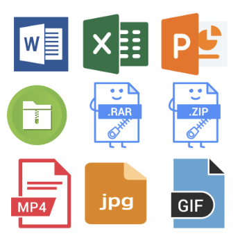
```

Binary files require software to open them and are typically not human-readable

Files like MS Word, Excel, and other proprietary software files  

Executable files like application installation files (.dmgs or .exe)  

Media files like .png, .jpg .mp4 or .mov files

Encryption or compression files (.zip or .rar)

Humans can't read these files

> *These files need software to open and edit, and usually can't be viewed via the command line. Most media files, database files, executables, and zipped files are binary files.*   
> *You can view plain text files, but you probably need to know the language if you're going to edit or create these files.*

## Slide 11: Rectangular files (spreadsheets)

```{r 07-rectangles, echo=FALSE}
# fs::dir_ls("figs")
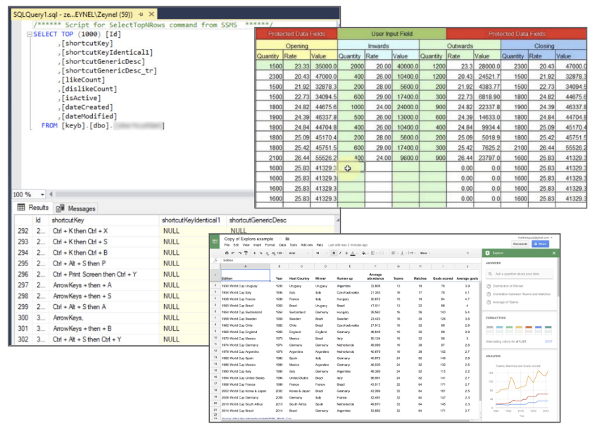
```

These are files stored in columns and rows (or variables and observations)

Rectangular files usually require spreadsheet software (Excel or OpenOffice) or relational database software.

> *Understanding how to access, manipulate, and extract the information in rectangular files (i.e., spreadsheets) is an essential part of data work because of how ubiquitous tabular data are. An absolute must-read for data in spreadsheets is ["Data Organization in Spreadsheets"](https://www.tandfonline.com/doi/full/10.1080/00031305.2017.1375989) by Karl Broman and Kara Woo.* 

## Slide 12: Non-rectangular files (JSON & XML)

```{r 08-xml-json, echo=FALSE}
# fs::dir_ls("figs")

```

Non-rectangular data files (like JSON and XML) are commonly used on the web for storing data.

JSON was (JavaScript Object Notation) created in 2002, and used for data storage and transfer

XML (extensible markup language) is slightly older technology (created in 1996), but still widely used for the same purpose

> *Internet technologies commonly use non-rectangular data files (like JSON and XML). [JSON](https://www.json.org/) (pronounced Jay-SON) is the JavaScript Object Notation format, and it looks a little like a list (if you've seen these before). [XML](https://en.wikipedia.org/wiki/XML) (or extensible markup language) is a data description language that's useful for sharing information between different software systems.*

## Slide 13: JSON objects 

```{r 13-json, echo=FALSE}
# fs::dir_ls("figs")
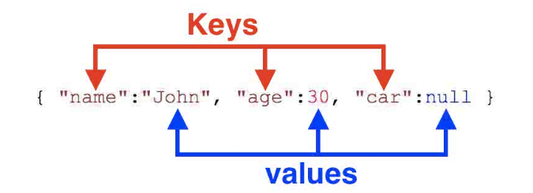
```

JSON is an object notation language and stores data in objects and arrays 

Why would anyone store data this way? JSON can store data and the attributes of the data within the same object.

> *[JSON](https://www.json.org/) data is a general-purpose, lightweight format, widely accessible, and relatively simple. You'll find JSON used directly in JavaScript code for Web pages, and it's the file format of choice for many APIs.*  
> *JSON Data Types: null, true, false, number, string*  
> *JSON Data Containers: square brackets [ ], curly brackets { }*   
> *JSON objects (in contrast to rectangular database models) can store the set of attributes for an object within the object. JSON objects have a flexible representation because they don't confine your data to columns and rows (now you can include text, images, etc.).*   
> *However, these objects typically need to be coerced into a rectangular object before analyzing.*  

## Slide 14: XML objects

```{r 14-xml, echo=FALSE}
# fs::dir_ls("figs")

```


- [XML](https://en.wikipedia.org/wiki/XML) (eXtensible Markup Language) is a language used to encode web documents and data structures

- XML is also useful for transmitting information between different software systems and through APIs

- XML was designed to be "self-descriptive" and carry data in a readable format 

> *XML is also useful for transmitting information between different software systems and through APIs. You can read more about the XML standard here on [W3Schools](https://www.w3schools.com/xml/default.asp).*

This is an example of a complete XML document:

```xml
<?xml version="1.0"?> 
<temperatures>
      <filename>ISCCPMonthly_avg.nc</filename>
      <case date="16-JAN-1994"
            temperature="278.9"/> 
</temperatures>
```

> *'Readable' here means by humans and machines, and the difference between XML and HTML is that XML is used to transport information, while HTML is used to display information.*

## Slide 15: Why bother with these technologies?

> *These are weird formats--why do we need to spend all this time learning how to use them?*

## Slide 16: API: Application Programming Interface 

```{r 16-api-cat.png, echo=FALSE}
# fs::dir_ls("figs")
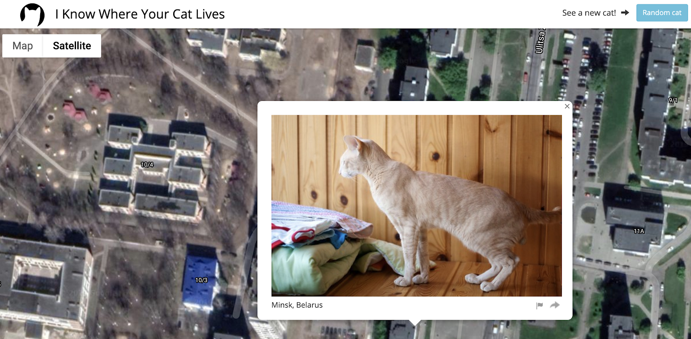
```

- An [API](https://medium.com/@perrysetgo/what-exactly-is-an-api-69f36968a41f) is the set of instructions for accessing or transmitting information between software applications

- JSON and XML are usually how data are transferred in/out of APIs 

Example: [I Know Where Your Cat Lives](https://iknowwhereyourcatlives.com/).

From about, 

> *"I Know Where Your Cat Lives iknowwhereyourcatlives.com is a data visualization experiment that locates a sample of one million public images of cats on a world map by the latitude and longitude coordinates embedded in their metadata. The cats were accessed via publicly available APIs provided by popular photo sharing websites. The photos were then run through various clustering algorithms using a supercomputer in order to represent the enormity of the data source."*

## Slide 17: API: Application Programming Interface 

```{r 17-api.png, echo=FALSE}
# fs::dir_ls("figs")
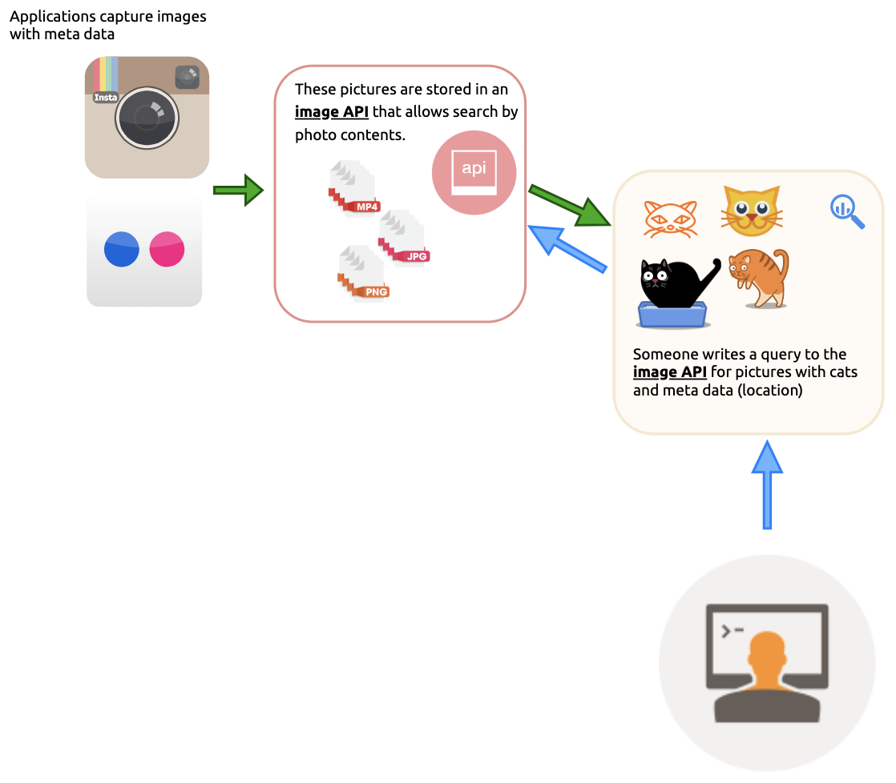
```

1) Photos from Flickr and Instagram get stored in an API 

2) Requests are made for certain photos with GPS data 

> *I know Where Your Cat Lives is a project that uses the APIs of Flickr and Instagram to access certain photos (i.e. photos of cats, or a specific landmark) with GPS data (in something called an `Exif` record).* 

## Slide 18: API: Application Programming Interface 

3) Combine image meta data with GPS data from OpenStreetMap API 

```{r 18-api.png, echo=FALSE}
# fs::dir_ls("figs")
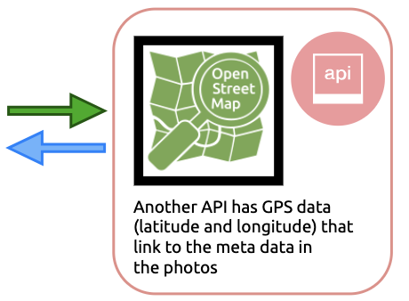
```


> *Example: I Know Where Your Cat Lives * 

> *I know Where Your Cat Lives is a project that uses the APIs of Flickr and Instagram to access certain photos (i.e. photos of cats, or a specific landmark) with GPS data (in something called an `Exif` record).* 

> *GPS data is imported via a map application API, then these photos are placed on a map according to the metadata stored in their photo.*

## Slide 19: API: Application Programming Interface 

```{r 19-cat-api, echo=FALSE}
# fs::dir_ls("figs")
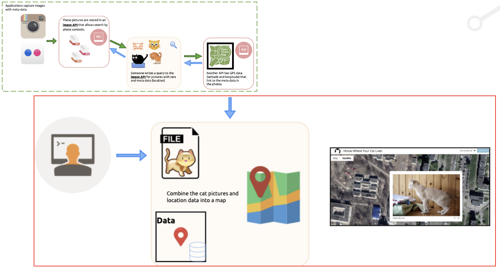
```

4) Use Google Maps to display the image on the satellite image 


> *Example: I Know Where Your Cat Lives * 

> *I know Where Your Cat Lives is a project that uses the APIs of Flickr and Instagram to access certain photos (i.e. photos of cats, or a specific landmark) with GPS data (in something called an `Exif` record).* 

> *GPS data is imported via a map application API, then these photos are placed on a map according to the metadata stored in their photo.*

> *These images and maps are then loaded into an application that load the two at the same time.*

## Slide 20: A Quick Example

***

## Slide 21: Load Address Data into OpenRefine

```{r 21-cols.png, echo=FALSE}
# fs::dir_ls("figs")
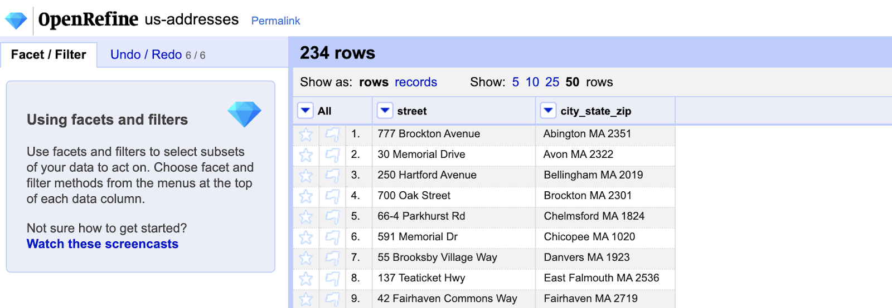
```

1. Navigate to this link and load the addresses into OpenRefine:

[Raw CSV address data](https://raw.githubusercontent.com/mjfrigaard/cleaning-data-part2/master/data/csv/us-addresses.csv)

2. Create a new project called us-addresses
 
APIs let you combine data from multiple sources, and there really is no limit to the amount of available API data. Just to list a few:

1. [data.world](https://apidocs.data.world/api)  
2. [datausa.io](https://datausa.io/about/api/)  
3. [opensecrets](https://www.opensecrets.org/open-data/api)  
4. [govinfo api](https://api.govinfo.gov/docs/)  

We will be using the OpenMapQuest API to access longitude and latitude information from a .csv file of 234 addresses in Massachusetts and New York.

These addresses are in two columns, `street` and `city_state_zip.`

## Slide 22: Create full_address column

```{r 22-create-cols, echo=FALSE}
# fs::dir_ls("figs")
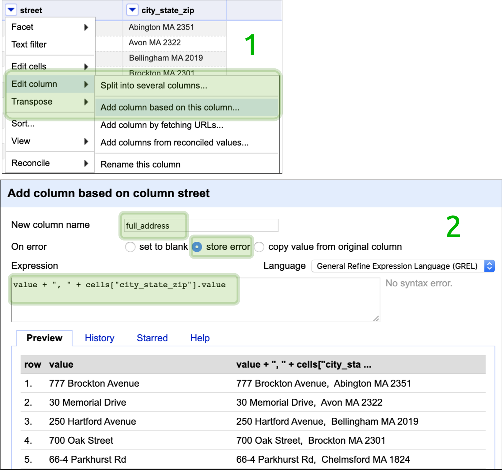
```

Use the following GREL code to create a new `full_address` column:

`value + ", " + cells["city_state_zip"].value`

Click **OK**.

Select the little arrow on the street column and click on,

  **Edit column > Add column based on this column**
  
Here we're going to use the General Refine Expression Language (GREL), but OpenRefine also allows for Jython (Python implemented in Java), and Clojure (a functional language that resembles Lisp). There are quite a few resources out there for GREL expressions, but I like the one from Illinois Library. We're going to use the GREL language to prepare the address columns for mapping.

Select the little arrow on the `street` column and click on **Edit column >> Add column based on this column**. 

In the dialogue box  under **'New column name'**, enter the name of the new column (`full_address`). 

In the section for On error, select `store error`. Under the section for the **Expression**, enter the GREL expression below:

`value + ", " + cells["city_state_zip"].value`

This will give us a new column with street, city, state, and zip.

## Slide 23: Arrange columns

```{r 23-arrange-cols, echo=FALSE}
# fs::dir_ls("figs", regexp = "23")
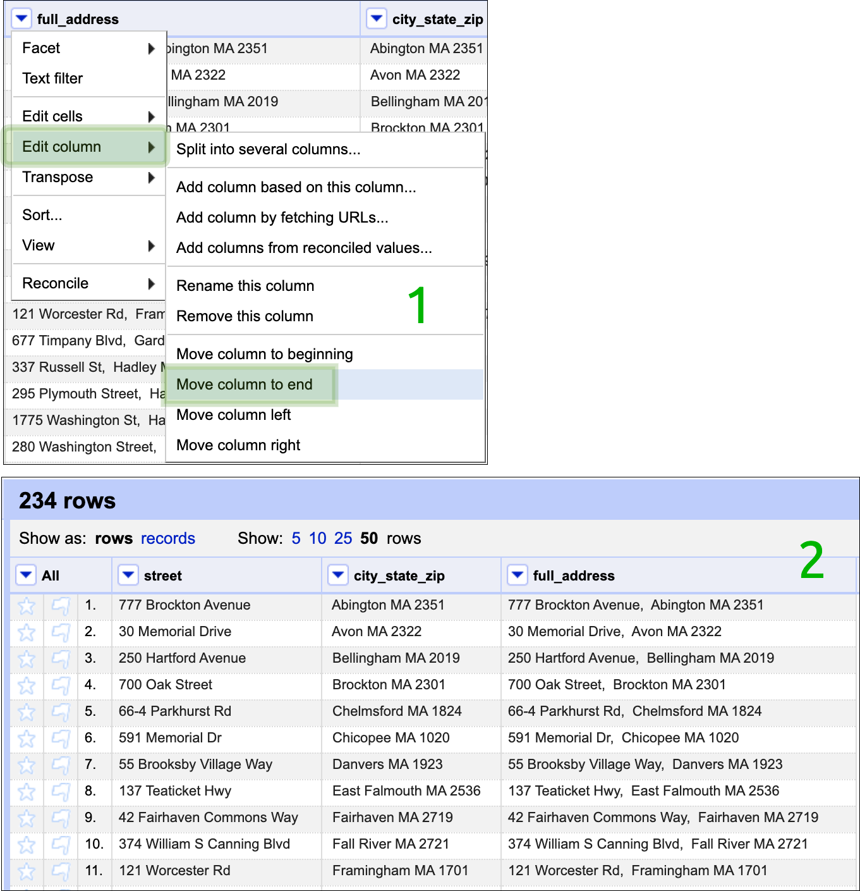
```

Select the little arrow on the new `full_address` column and click on,

 **Edit column** > **Move column to the end**
 
Just to make things a little clearer, we'll move the new column to the end. Moving columns around gives us the ability to view columns side-by-side, and provides some visible reassurance about the data transformations we're making. 

## Slide 24: MapQuest API

```{r 24, echo=FALSE}
# fs::dir_ls("figs", regexp = "24")
# 
```

Head over to: 

https://developer.mapquest.com/

Click on the button to get your Free API Key

Head over to MapQuest and get a Free API Key. 

The instructions are fairly straightforward, but you will need to get into the developer dashboard. 

## Slide 25: Create and Approve MapQuest API Key

```{r 25, echo=FALSE}
# fs::dir_ls("figs", regexp = "25")
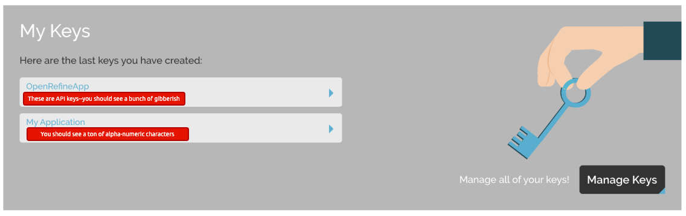
```

1. You can create a new key or use the one listed under My Application

```{r 25.1, echo=FALSE}
# fs::dir_ls("figs", regexp = "25")
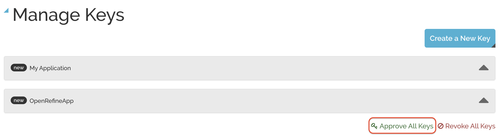
```

2. Click Manage Keys then Approve All Keys 

Head over to MapQuest and get a Free API Key. 

The instructions are fairly straightforward, but you will need to get into the developer dashboard, and your keys will be under Manage Keys

You can create a new application, or use the one given under My Application. Read more about API keys [here.](https://developer.mapquest.com/documentation/)

## Slide 26: APIs with OpenRefine

OpenRefine works with GET request APIs.

```{r 26, echo=FALSE}
# fs::dir_ls("figs", regexp = "26")
# 
```

## Slide 27: Example MapQuest API query 

```{r 27, echo=FALSE}
# fs::dir_ls("figs", regexp = "27")
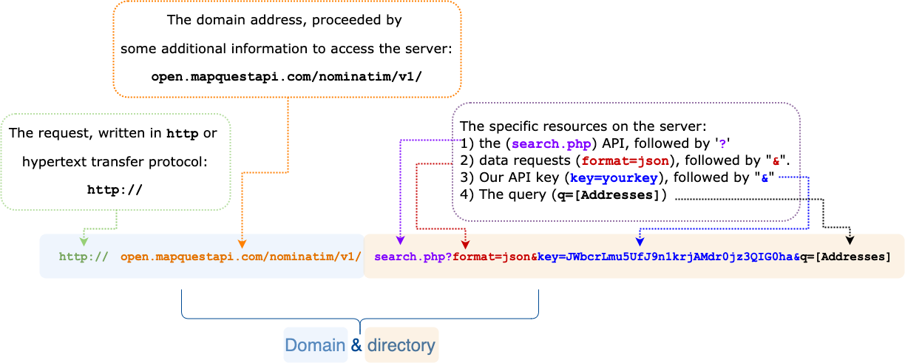
```

Learning the components of API requests is an important part of accessing and gathering data. Most sites have at least a little documentation about how to access the data available on their API. When they don't, fortunately all requests have similar components and syntax. 

The parts of an API request are in the figure above. You can also read more on the documentation website here.

## Slide 28: Example API query parameters with GREL

```{r 28, echo=FALSE}
# fs::dir_ls("figs", regexp = "28")
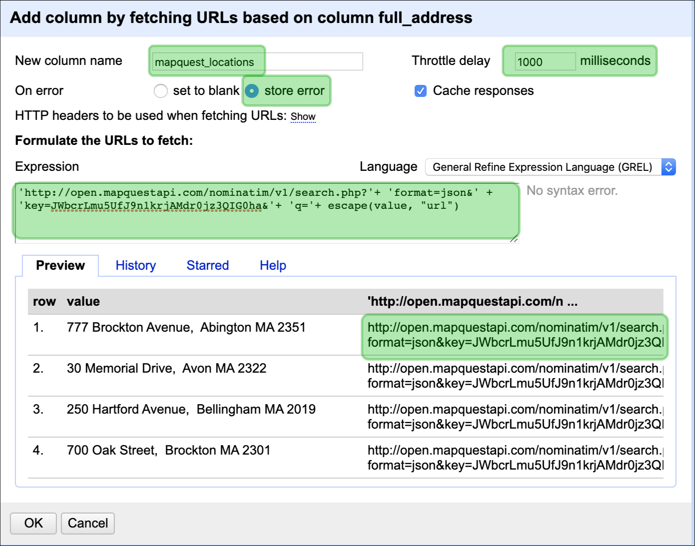
```

Click on the new `full_address` column and select, Add column by fetching URLs

Follow the steps in the diagram to the right, but refer to the notes below for the GREL expression:

After you've entered the Expression, check the 1st row in the Preview section at the bottom of the dialogue box.

Now we will create another column using OpenRefine's data enrichment abilities. OpenRefine gives us the ability to load various data APIs into our existing projects. 

New column name = `mapquest_locations`

On error = **store error** 

Throttle delay = **1000** milliseconds 

Expression = `'http://open.mapquestapi.com/nominatim/v1/search.php?'+ 'format=json&' + 'key=JWbcrLmu5UfJ9n1krjAMdr0jz3QIG0ha&'+ 'q='+ escape(value, "url")`


## Slide 29: Example API query parameters with GREL

This takes time!

```{r 29, echo=FALSE}
# fs::dir_ls("figs", regexp = "29")
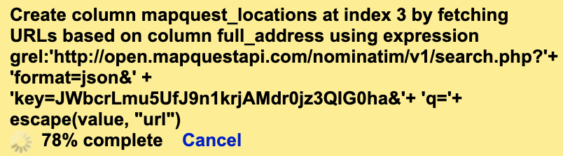
```


It took me a few minutes to run this API request, so expect to wait a bit for the data to load into OpenRefine.

## Slide 30: JSON data

When you're done, you should see the following JSON data in the new `mapquest_locations` column

After OpenRefine is finished loading the data into `mapquest_locations`, you'll see the JSON data is all crammed into a single row. This makes it very hard to see what's in this new column, so we'll need to parse the JSON data into something a little easier to work with. 

```{r 30-json-col.png, echo=FALSE}
# fs::dir_ls("figs", regexp = "30")
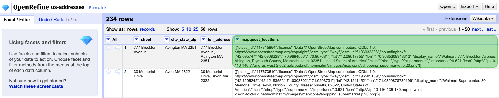
```

## Slide 31: Parsing JSON data in OpenRefine

```{r 31-json-col.png, echo=FALSE}
# fs::dir_ls("figs", regexp = "31")
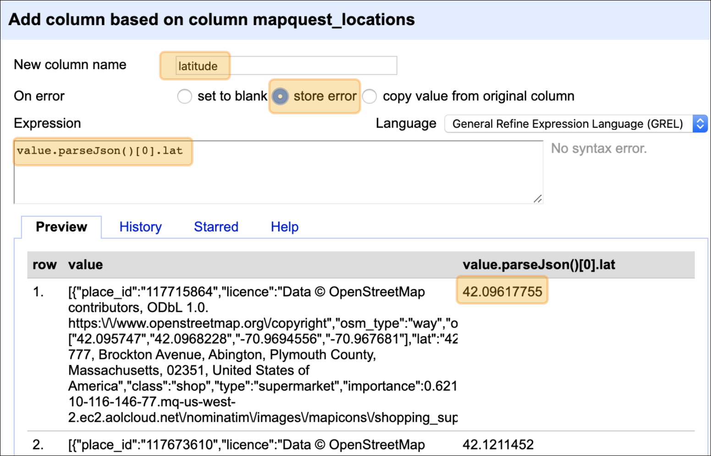
```

Click on the new mapquest_locations column and select Edit column > Add column based on this column...

In the dialogue box, enter the following options:  

1. Name new column = `latitude`   

2. On error = `store error`  

3. Expression = `value.parseJson()[0].lat`

3. Verify this is correct in the Preview pane   

Parsing JSON data in OpenRefine is made simpler using GREL's `parseJson()` function. We can enter the following expression into the Expression box, 

`value.parseJson()[0].lat`

Then we name our new column (`latitude`), and select `store error` (this is a good practice in case there was a typo or anything that needs to be debugged). We also want to check out the contents in the **Preview** pane at the bottom of the dialogue window (make sure it looks like `latitude` data).

Repeat the same steps on the `mapquest_locations` column, but this time create a `longitude` column

## Slide 32: Parsing JSON data in OpenRefine

Repeating the process is exactly the same as the process above, but I'm going to change lat to lon

`value.parseJson()[0].lon`

Check to make sure this code is working, then click "OK".

```{r 32-parse-lon, echo=FALSE}
# fs::dir_ls("figs", regexp = "32")
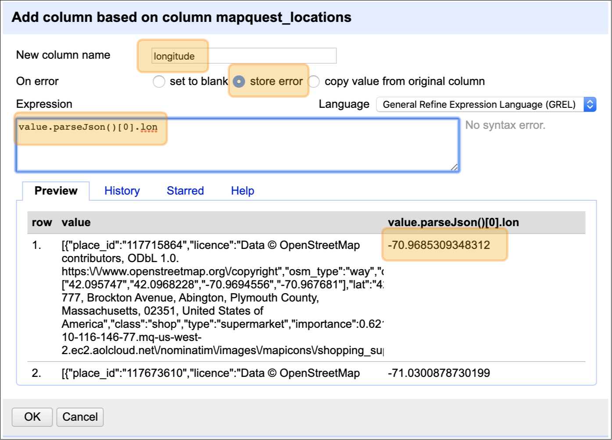
```

## Slide 33: Save each step as a JSON file

Click on the Undo/ Redo icon next to Facet / Filter

Identify the steps needed to create this data set (6 of them)

```{r 33-undo-redo, echo=FALSE}
# fs::dir_ls("figs", regexp = "33")
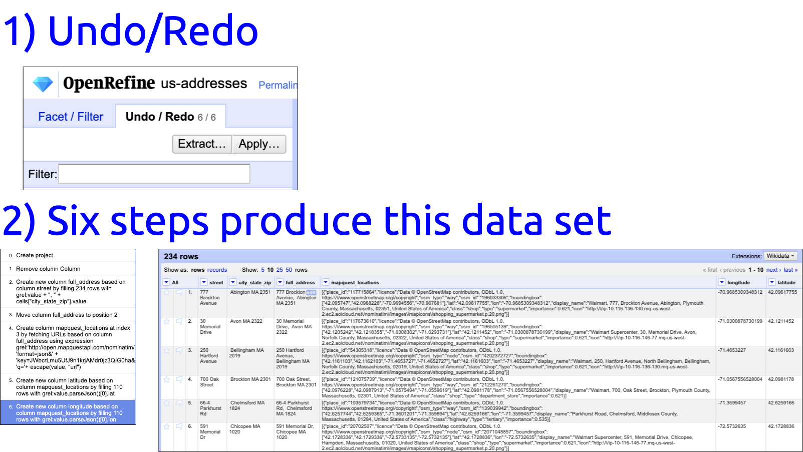
```

> *I want to make sure and save all the steps I just took to create these new columns, so I'm going to use OpenRefine's Undo/Redo section.*


## Slide 34: Save each step as a JSON file

I want to make sure and save all the steps I just took to create these new columns, so I'm going to use OpenRefine's Undo/Redo section.

Make sure to save the contents to a file that you can change the extension to "`.json`"

Store this in the same folder as the "`us-addresses.csv`" file with some description. 

- Click on the Extract button (next to Apply)

- Make sure all the check the boxes! 

```{r 34-extract, echo=FALSE}
# fs::dir_ls("figs", regexp = "34")
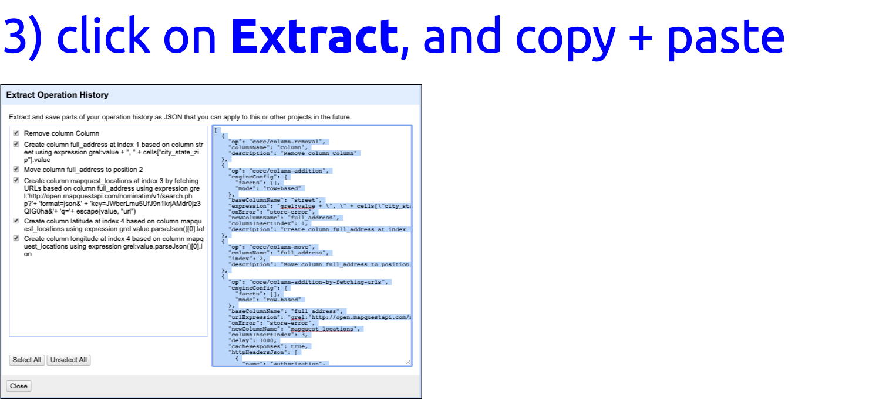
```


- Copy + Paste this into a file and save for the next project!

```{json, eval=FALSE}
[
  {
    "op": "core/column-addition",
    "engineConfig": {
      "facets": [],
      "mode": "row-based"
    },
    "baseColumnName": "street",
    "expression": "grel:value + \", \" + cells[\"city_state_zip\"].value",
    "onError": "store-error",
    "newColumnName": "full_address",
    "columnInsertIndex": 1,
    "description": "Create column full_address at index 1 based on column street using expression grel:value + \", \" + cells[\"city_state_zip\"].value"
  }
]
```

## Slide 35: Check out these links to learn more!

1. John R Little has a great [Pragmatic Datafication workshop](https://www.johnlittle.info/presentation/dsvil-2018/) with some great materials, see the  [slides]() and [workbook]().

2. Check out the [OpenRefine GREL documentation on Github](https://github.com/OpenRefine/OpenRefine/wiki/GREL-Other-Functions) (lots of great tidbits in here!)

3. Good 'ol fashioned YouTube! Check out the following video to learn more: 

  - [Data Journalism - Cleaning Data in Workbench and OpenRefine](https://www.youtube.com/watch?v=omLnyrT8i1Q)
  
  - [OpenRefine Beginners Tutorial](https://www.youtube.com/watch?v=wfS1qTKFQoI)
  
  - [Clean Your Data: Getting Started with OpenRefine](https://www.youtube.com/watch?v=wGVtycv3SS0)
  

Check out [these slides](http://bit.ly/bu-cleaning-data-p2) and the [github page](https://mjfrigaard.github.io/cleaning-data-part2/) for more information!


