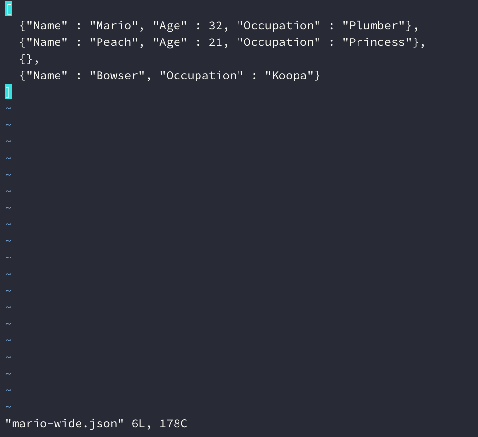

JSON import and cleaning
================

Load the packages

``` r
library(RJSONIO)
library(rjson)
library(jsonlite)
```

# Motivation

This file imports and cleans various JSON data files.

## JSON Data Types

There are four JSON data types.

`null`

`true`

`false`

`number`

`string`

## JSON Data Containers

And two data containers

1.  square brackets `[ ]`

2.  curly brackets `{ }`

### Unnamed Arrays

Square brackets `[ ]` are used for ordered unnamed arrays

  - `[ 1, 2, 3, ... ]`

  - `[ true, true, false, ... ]`

### Named Arrays

Curly brackets `{ }` are used for named arrays

  - `{ "dollars" : 5, "euros" : 20, ... }`

  - `{ "city" : "Berkeley", "state" : "CA", ... }`

### Containers can be nested

Example A

``` json
{
  "name": ["X", "Y", "Z"],
  "grams": [300, 200, 500],
  "qty": [4, 5, null],
  "new": [true, false, true],
}
```

Example B

``` json
[
    { "name": "X",
      "grams": 300,
      "qty": 4,
      "new": true },
    { "name": "Y",
      "grams": 200,
      "qty": 5,
      "new": false },
    { "name": "Z",
      "grams": 500,
      "qty": null,
      "new": true}
]
```

``` r
mario_wide <- readr::read_file(file = "data/json/mario-wide.json")
cat(mario_wide)
```

    #>  [
    #>    {"Name" : "Mario", "Age" : 32, "Occupation" : "Plumber"}, 
    #>    {"Name" : "Peach", "Age" : 21, "Occupation" : "Princess"},
    #>    {},
    #>    {"Name" : "Bowser", "Occupation" : "Koopa"}
    #>  ]

``` r
MarioWideData <- jsonlite::fromJSON(mario_wide)
MarioWideData
```

    #>      Name Age Occupation
    #>  1  Mario  32    Plumber
    #>  2  Peach  21   Princess
    #>  3   <NA>  NA       <NA>
    #>  4 Bowser  NA      Koopa

``` r
mario_long <- readr::read_file(file = "data/json/mario-long.json")
cat(mario_long)
```

    #>  [
    #>    {
    #>      "Name": "Mario",
    #>      "Age": 32,
    #>      "Occupation": "Plumber",
    #>      "Ranking": 3
    #>    },
    #>    {
    #>      "Name": "Peach",
    #>      "Age": 21,
    #>      "Occupation": "Princess",
    #>      "Ranking": 1
    #>    },
    #>    {
    #>      "Ranking": 2
    #>    },
    #>    {
    #>      "Name": "Bowser",
    #>      "Occupation": "Koopa",
    #>      "Ranking": 4
    #>    }
    #>  ]

``` r
MarioLongData <- jsonlite::fromJSON(mario_long)
MarioLongData
```

    #>      Name Age Occupation Ranking
    #>  1  Mario  32    Plumber       3
    #>  2  Peach  21   Princess       1
    #>  3   <NA>  NA       <NA>       2
    #>  4 Bowser  NA      Koopa       4

## ASIDE: Check Invisibles

Check the invisible characters with `vi`

``` bash
$ vi mario_long
```



## Data USA (datausa.io housing data)

  - Source: [Dallas Texas
    Housing](https://datausa.io/profile/geo/dallas-tx/#housing)

  - Data USA API documentation: [Data USA API
    Documentation](https://github.com/DataUSA/datausa-api/wiki/Data-API#ipeds)

### Components of API requests

The various components of the API request (text string dropped in the
url to download JSON data).

`https://api.datausa.io/api/` = root url

`?show=geo&` = beginning of API request, the `?show=geo` is indicating
the [location
id](https://github.com/DataUSA/datausa-api/wiki/Attribute-API#geo),
which is the following table of information

| column name    | description                                                                                                                          |
| -------------- | ------------------------------------------------------------------------------------------------------------------------------------ |
| `id`           | unique ID                                                                                                                            |
| `name`         | if there are no conflicts, will be the same as name\_long, otherwise will be suffixed by addition geography (ex. Suffolk County, MA) |
| `name_long`    | the shortest version of the attribute name (ex. Suffolk County)                                                                      |
| `display_name` | cleaned names, used for profile page titles                                                                                          |
| `url_name`     | slug name used in URL structure                                                                                                      |
| `sumlevel`     | attribute sumlevel                                                                                                                   |
| `image_link`   | link to image source on flickr                                                                                                       |
| `image_author` | image credit from flickr                                                                                                             |
| `image_meta`   | any information about the image’s content, if available                                                                              |

`sumlevel=state&` = below are the possible options for `sumlevel`. We’re
obviously collecting data on the `state`.

| `sumlevel` | prefix description                                                       |
| ---------- | ------------------------------------------------------------------------ |
| `nation`   | 010 Aggregate US data                                                    |
| `state`    | 040 US States (includin D.C. and Puerto Rico)                            |
| `county`   | 050 US Counties                                                          |
| `place`    | 160 Census Designated Places                                             |
| `msa`      | 310 Metropolitan Statistical Area                                        |
| `puma`     | 795 Public Use Micro Data Sample Area, a census subdivision of US states |

`force=pums_1yr.ygo&`

`limit=5`

## View all location attributes

This API request will get all the location attributes.

``` r
utils::download.file(url = "http://api.datausa.io/attrs/geo/", 
              destfile = "data/json/geo_attrs.json")
```

### Import the JSON data

Now we can import these data using `readr::read_file()`

``` r
geo_attrs_json <- readr::read_file("data/json/geo_attrs.json")
```

``` bash
# cd data/json
# ls
# head geo_attrs.json
```

This file is in the original format (JSON), but it’s not the way we want
it imported. We can use the `jsonlite::fromJSON()` function.

### Convert JSON to list

We can change the imported file (JSON data) to a `list` using
`jsonlite::fromJSON()`.

``` r
datausa_locations <- jsonlite::fromJSON(geo_attrs_json)
utils::str(datausa_locations)
```

    #>  List of 2
    #>   $ data   : chr [1:36288, 1:10] "pray-mt" "hartsville-trousdale-county-tn" "park-city-mt" "hinsdale-mt" ...
    #>   $ headers: chr [1:10] "url_name" "display_name" "name" "image_link" ...

There are two items in this list (`data` and `header`), so we’ll extract
the `$data` portion using `base::as.data.frame()`.

``` r
DataUsaLocData <- base::as.data.frame(datausa_locations$data)
# assign the names to the data frame
colnames(DataUsaLocData) <- datausa_locations$headers
DataUsaLocData %>% dplyr::glimpse(78)
```

    #>  Observations: 36,288
    #>  Variables: 10
    #>  $ url_name     <fct> pray-mt, hartsville-trousdale-county-tn, park-city-mt,…
    #>  $ display_name <fct> "Pray, MT", "Hartsville/Trousdale County, TN", "Park C…
    #>  $ name         <fct> "Pray", "Hartsville/Trousdale County, TN", "Park City"…
    #>  $ image_link   <fct> NA, NA, NA, NA, NA, NA, NA, NA, NA, NA, NA, NA, NA, NA…
    #>  $ sumlevel     <fct> 160, 160, 160, 160, 160, 160, 160, 160, 160, 160, 160,…
    #>  $ image_meta   <fct> NA, NA, NA, NA, NA, NA, NA, NA, NA, NA, NA, NA, NA, NA…
    #>  $ image_author <fct> NA, NA, NA, NA, NA, NA, NA, NA, NA, NA, NA, NA, NA, NA…
    #>  $ keywords     <fct> NA, NA, NA, NA, NA, NA, NA, NA, NA, NA, NA, NA, NA, NA…
    #>  $ id           <fct> 16000US3059725, 16000US4732742, 16000US3056575, 16000U…
    #>  $ name_long    <fct> Pray, Hartsville/Trousdale County, Park City, Hinsdale…

So now we have a `data.frame` with two columns, `url_name` and
`display_name`.

## Download the ACS (Metropolitan Statistical Area)

The `sort=desc` is pretty self explanatory (sort the data descending),
but the `force` parameter needs a bit more explanation. The `force`
parameter requires the following two components,
`schema_name.table_name`. This, “*Forces the use of a particular data
table.*” Read more about this in the [query
parameters](https://github.com/DataUSA/datausa-api/wiki/Data-API#query-parameters).
I’ve also copied the table below.

| **parameter**         | **accepted values**                                                             | **description**                                                                                                          |
| --------------------- | ------------------------------------------------------------------------------- | ------------------------------------------------------------------------------------------------------------------------ |
| `force`               | `schema_name.table_name` (Example)                                              | Forces the use of a particular data table.                                                                               |
| `limit`               | integer                                                                         | Limits the number of rows returned by the query.                                                                         |
| `order`               | any available column name                                                       | Column name to use for ordering the resulting data array.                                                                |
| `show (required)`     | any available attribute                                                         | A comma-separated list of attributes to show in the query.                                                               |
| `sort`                | `desc` or `asc`                                                                 | Changes the sort order of the returned data array.                                                                       |
| `sumlevel (required)` | any available sumlevel for the given attribute                                  | This restricts the data fetched to only display the specified sumlevel(s).                                               |
|                       |                                                                                 | If more than one “show” attribute is specified, sumlevel must be a comma-separated list with a value for each attribute. |
| `required`            | any available column name                                                       | A comma-separated list of column names to be returned in the query.                                                      |
| `where`               | [see documentation](https://github.com/DataUSA/datausa-api/wiki/Data-API#where) | Advanced filtering of columns, similar to the WHERE clause on SQL.                                                       |
| `year`                | `latest`, `oldest`, `all`, 4-digit year                                         | Filters the returned data to the given year.                                                                             |

``` r
utils::download.file(url = "https://api.datausa.io/api/?sort=desc&force=acs.yg&show=geo&sumlevel=msa&year=latest", 
              destfile = "data/json/datausa-acs-yg.json")
```

``` r
us_metro_rank <- jsonlite::fromJSON("data/json/datausa-acs-yg.json")
str(us_metro_rank)
```

    #>  List of 5
    #>   $ data   : chr [1:945, 1:19] "2016" "2016" "2016" "2016" ...
    #>   $ headers: chr [1:19] "year" "geo" "age" "age_moe" ...
    #>   $ source :List of 5
    #>    ..$ link            : chr "http://www.census.gov/programs-surveys/acs/"
    #>    ..$ org             : chr "Census Bureau"
    #>    ..$ table           : chr "acs_5yr.yg"
    #>    ..$ supported_levels:List of 1
    #>    .. ..$ geo: chr [1:8] "nation" "state" "county" "msa" ...
    #>    ..$ dataset         : chr "2016 ACS 5-year Estimate"
    #>   $ subs   :List of 1
    #>    ..$ force: chr "acs_5yr"
    #>   $ logic  :'data.frame':    1 obs. of  5 variables:
    #>    ..$ link            : chr "http://www.census.gov/programs-surveys/acs/"
    #>    ..$ org             : chr "Census Bureau"
    #>    ..$ table           : chr "acs_5yr.yg"
    #>    ..$ supported_levels:'data.frame':    1 obs. of  1 variable:
    #>    .. ..$ geo:List of 1
    #>    .. .. ..$ : chr [1:8] "nation" "state" "county" "msa" ...
    #>    ..$ dataset         : chr "2016 ACS 5-year Estimate"

``` r
USMetroRankData <- base::as.data.frame(us_metro_rank$data)
colnames(USMetroRankData) <- us_metro_rank$headers
USMetroRankData %>% dplyr::glimpse(78)
```

    #>  Observations: 945
    #>  Variables: 19
    #>  $ year                         <fct> 2016, 2016, 2016, 2016, 2016, 2016, 20…
    #>  $ geo                          <fct> 31000US10100, 31000US10140, 31000US101…
    #>  $ age                          <fct> 38.2, 43, 33.9, 35.3, 38.9, 41.2, 40.3…
    #>  $ age_moe                      <fct> 0.6, 0.3, 0.2, 0.2, 0.6, 0.4, 0.2, 0.1…
    #>  $ pop                          <fct> 42430, 71233, 168774, 38213, 18760, 98…
    #>  $ pop_moe                      <fct> NA, NA, NA, NA, NA, NA, NA, NA, NA, NA…
    #>  $ non_us_citizens              <fct> 0.0255008, 0.0322323, 0.0289559, 0.014…
    #>  $ mean_commute_minutes         <fct> 12.6572, 23.5186, 16.7492, 16.8806, 28…
    #>  $ income                       <fct> 53682, 44521, 46473, 44041, 11296, 493…
    #>  $ income_moe                   <fct> 2316, 1713, 1571, 2036, 1218, 1450, 45…
    #>  $ owner_occupied_housing_units <fct> 0.686812, 0.670865, 0.616734, 0.641983…
    #>  $ median_property_value        <fct> 147300, 159400, 98200, 113100, 90900, …
    #>  $ median_property_value_moe    <fct> 5571, 4296, 1916, 4453, 6343, 2741, 18…
    #>  $ estimate                     <fct> 5, 5, 5, 5, 5, 5, 5, 5, 5, 5, 5, 5, 5,…
    #>  $ age_rank                     <fct> 533, 140, 800, 749, 473, 254, 333, 347…
    #>  $ pop_rank                     <fct> 676, 481, 251, 729, 923, 389, 156, 79,…
    #>  $ income_rank                  <fct> 215, 577, 501, 599, 945, 386, 941, 279…
    #>  $ us_citizens                  <fct> 0.974499, 0.967768, 0.971044, 0.985005…
    #>  $ non_eng_speakers_pct         <fct> 0.062796, 0.0901031, 0.157721, 0.04873…

``` r
USMetroRankData <- USMetroRankData %>%
  dplyr::mutate(
    id = geo, 
    pop = as.integer(pop),
    pop_rank = as.integer(pop_rank))
USMetroRankData %>% dplyr::glimpse(78)
```

    #>  Observations: 945
    #>  Variables: 20
    #>  $ year                         <fct> 2016, 2016, 2016, 2016, 2016, 2016, 20…
    #>  $ geo                          <fct> 31000US10100, 31000US10140, 31000US101…
    #>  $ age                          <fct> 38.2, 43, 33.9, 35.3, 38.9, 41.2, 40.3…
    #>  $ age_moe                      <fct> 0.6, 0.3, 0.2, 0.2, 0.6, 0.4, 0.2, 0.1…
    #>  $ pop                          <int> 571, 824, 163, 505, 196, 940, 405, 818…
    #>  $ pop_moe                      <fct> NA, NA, NA, NA, NA, NA, NA, NA, NA, NA…
    #>  $ non_us_citizens              <fct> 0.0255008, 0.0322323, 0.0289559, 0.014…
    #>  $ mean_commute_minutes         <fct> 12.6572, 23.5186, 16.7492, 16.8806, 28…
    #>  $ income                       <fct> 53682, 44521, 46473, 44041, 11296, 493…
    #>  $ income_moe                   <fct> 2316, 1713, 1571, 2036, 1218, 1450, 45…
    #>  $ owner_occupied_housing_units <fct> 0.686812, 0.670865, 0.616734, 0.641983…
    #>  $ median_property_value        <fct> 147300, 159400, 98200, 113100, 90900, …
    #>  $ median_property_value_moe    <fct> 5571, 4296, 1916, 4453, 6343, 2741, 18…
    #>  $ estimate                     <fct> 5, 5, 5, 5, 5, 5, 5, 5, 5, 5, 5, 5, 5,…
    #>  $ age_rank                     <fct> 533, 140, 800, 749, 473, 254, 333, 347…
    #>  $ pop_rank                     <int> 641, 425, 170, 700, 915, 322, 64, 767,…
    #>  $ income_rank                  <fct> 215, 577, 501, 599, 945, 386, 941, 279…
    #>  $ us_citizens                  <fct> 0.974499, 0.967768, 0.971044, 0.985005…
    #>  $ non_eng_speakers_pct         <fct> 0.062796, 0.0901031, 0.157721, 0.04873…
    #>  $ id                           <fct> 31000US10100, 31000US10140, 31000US101…

``` r
USMetroRankData %>%
  dplyr::select(id, 
         pop, 
         pop_rank) %>%
  dplyr::arrange(pop_rank) %>%
  dplyr::left_join(x = .,
                   y = DataUsaLocData, 
                   by = "id") %>% 
    dplyr::glimpse(78)
```

    #>  Observations: 945
    #>  Variables: 12
    #>  $ id           <chr> "31000US35620", "31000US14460", "31000US16860", "31000…
    #>  $ pop          <int> 216, 644, 714, 711, 710, 702, 697, 690, 671, 670, 666,…
    #>  $ pop_rank     <int> 1, 2, 3, 4, 5, 6, 7, 8, 9, 10, 11, 12, 13, 14, 15, 16,…
    #>  $ url_name     <fct> new-york-northern-new-jersey-long-island-ny-nj-pa-metr…
    #>  $ display_name <fct> "New York-Newark-Jersey City, NY-NJ-PA Metro Area", "B…
    #>  $ name         <fct> "New York-Newark-Jersey City, NY-NJ-PA Metro Area", "B…
    #>  $ image_link   <fct> https://flic.kr/p/sMUuZw, https://flic.kr/p/8grTee, ht…
    #>  $ sumlevel     <fct> 310, 310, 310, 310, 310, 310, 310, 310, 310, 310, 310,…
    #>  $ image_meta   <fct> NA, NA, NA, NA, NA, NA, NA, "Old Orchard Beach pier", …
    #>  $ image_author <fct> rowens27, Emmanuel Huybrechts, Brent Moore, Ed Suomine…
    #>  $ keywords     <fct> NA, NA, NA, NA, NA, NA, NA, NA, NA, NA, NA, NA, NA, NA…
    #>  $ name_long    <fct> "New York-Newark-Jersey City, NY-NJ-PA Metro Area", "B…
